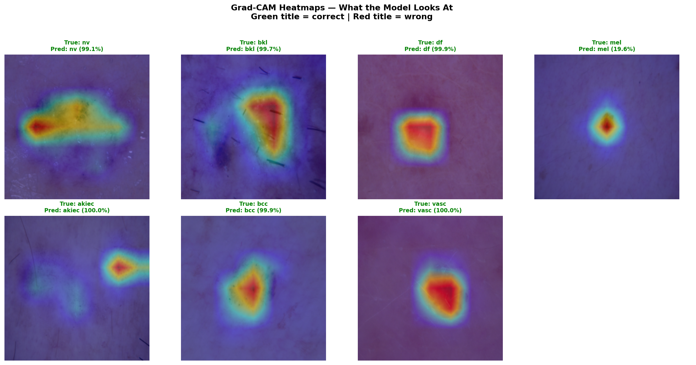
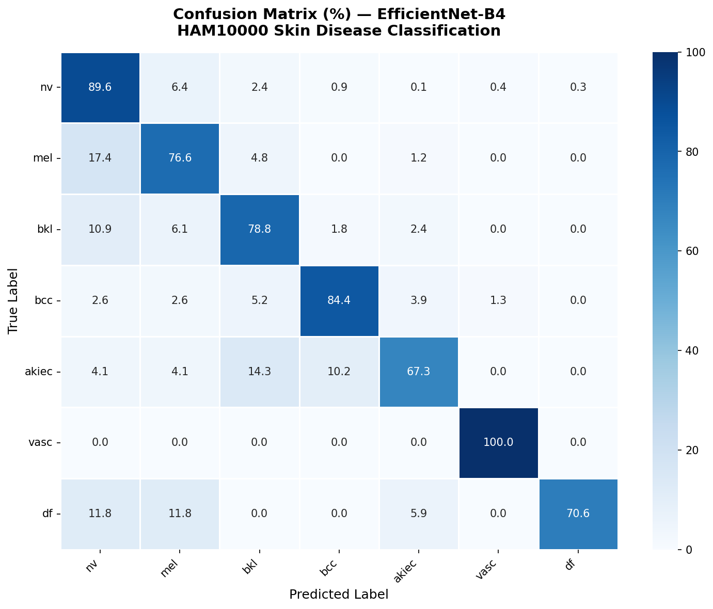

# 🔬 Skin Disease Classifier

An end-to-end medical AI application for skin lesion classification using deep learning. Trained on the HAM10000 dataset with EfficientNet-B4 backbone and deployed on AWS EC2.


---

## 🎯 Project Overview

This project classifies dermoscopy images into 7 skin disease categories using a pretrained EfficientNet-B4 CNN. The application features a REST API backend (FastAPI) and an interactive frontend (Streamlit), fully containerized with Docker and deployed on AWS EC2.

---

## 📊 Model Performance

| Metric | Score |
|---|---|
| Test Accuracy | 85.89% |
| Macro F1 Score | 0.7924 |
| Macro Recall | 0.8105 |
| Macro Precision | 0.7813 |
| Melanoma Recall | 76.65% |

---

## 🏥 7 Disease Classes

| Class | Disease | Risk Level | Test F1 |
|---|---|---|---|
| nv | Melanocytic Nevi (Mole) | 🟢 Low | 0.92 |
| mel | Melanoma | 🔴 High | 0.68 |
| bkl | Benign Keratosis | 🟢 Low | 0.77 |
| bcc | Basal Cell Carcinoma | 🟡 Medium | 0.82 |
| akiec | Actinic Keratosis | 🟡 Medium | 0.71 |
| vasc | Vascular Lesion | 🟢 Low | 0.90 |
| df | Dermatofibroma | 🟢 Low | 0.75 |

---

## 🗂️ Project Structure

```
skin-disease-classifier/
│
├── model/
│   └── best_model.pt              ← trained model weights (not in git)
│
├── api/
│   ├── main.py                    ← FastAPI app
│   ├── model.py                   ← model loader + inference
│   ├── schemas.py                 ← Pydantic request/response models
│   └── requirements.txt
│
├── ui/
│   ├── app.py                     ← Streamlit frontend
│   └── requirements.txt
│
├── notebooks/
│   ├── training.ipynb             ← Kaggle training notebook
│   └── evaluate.ipynb             ← evaluation + Grad-CAM notebook
│
├── outputs/
│   ├── confusion_matrix.png       ← test set confusion matrix
│   └── gradcam_heatmaps.png       ← Grad-CAM visualizations
│
├── dockerfile.api                 ← FastAPI Docker image
├── dockerfile.ui                  ← Streamlit Docker image
├── docker-compose.yml             ← orchestrate both services
├── .gitignore
└── README.md
```

---

## 🚀 Quick Start

### Prerequisites
- Python 3.11+
- Docker Desktop
- `best_model.pt` in `model/` folder

### Run Locally (without Docker)

**1. Create virtual environment:**
```bash
python -m venv venv
venv\Scripts\activate        # Windows
source venv/bin/activate     # Mac/Linux
```

**2. Install dependencies:**
```bash
pip install torch torchvision --index-url https://download.pytorch.org/whl/cpu
pip install fastapi uvicorn python-multipart pillow numpy streamlit plotly requests
```

**3. Start FastAPI (Terminal 1):**
```bash
cd api
uvicorn main:app --reload --port 8000
```

**4. Start Streamlit (Terminal 2):**
```bash
cd ui
streamlit run app.py
```

**5. Open browser:**
```
Streamlit UI  → http://localhost:8501
FastAPI docs  → http://localhost:8000/docs
```

---

### Run with Docker

**1. Build images:**
```bash
docker build -f dockerfile.api -t skin-disease-api .
docker build -f dockerfile.ui -t skin-disease-ui .
```

**2. Start both services:**
```bash
docker-compose up -d
```

**3. Open browser:**
```
Streamlit UI  → http://localhost:8501
FastAPI docs  → http://localhost:8000/docs
```

**4. Stop services:**
```bash
docker-compose down
```

---

## 🌐 API Endpoints

| Endpoint | Method | Description | Response |
|---|---|---|---|
| `/health` | GET | API health check | status, model, device, classes |
| `/classes` | GET | List all 7 classes | class names and count |
| `/predict` | POST | Predict skin disease | class, label, confidence, probabilities |

### Example Request
```bash
curl -X POST "http://localhost:8000/predict" \
  -H "accept: application/json" \
  -F "file=@skin_lesion.jpg"
```

### Example Response
```json
{
  "predicted_class": "mel",
  "label": "Melanoma",
  "confidence": 0.9951,
  "all_probabilities": {
    "nv": 0.0008,
    "mel": 0.9951,
    "bkl": 0.004,
    "bcc": 0.0001,
    "akiec": 0.0,
    "vasc": 0.0,
    "df": 0.0
  },
  "is_unknown": false
}
```

---

## 🧠 Model Architecture

```
Input Image (224×224×3)
        ↓
EfficientNet-B4 Backbone
(pretrained on ImageNet — 17.6M params)
        ↓
Global Average Pooling
        ↓
Dropout (0.4)
        ↓
Linear (1792 → 7)
        ↓
Softmax → 7 class probabilities
```

---

## 📈 Training Details

| Parameter | Value |
|---|---|
| Platform | Kaggle Notebooks (GPU T4 ×2) |
| Dataset | HAM10000 (10,015 images) |
| Train / Val / Test split | 70% / 15% / 15% |
| Backbone | EfficientNet-B4 (pretrained ImageNet) |
| Optimizer | Adam (lr=1e-3) |
| Loss Function | CrossEntropyLoss |
| Augmentation | Medium (flip, rotate, color jitter, blur) |
| LR Scheduler | CosineAnnealingLR (T_max=20) |
| Epochs | 20 |
| Batch Size | 16 |
| Training Time | ~45 minutes |

---

## 🔧 Class Imbalance Handling

The HAM10000 dataset has severe class imbalance (nv: 6,705 vs df: 115 samples). We addressed this with:

- **WeightedRandomSampler** — oversamples rare classes in each batch
- **Class weights in loss** — penalizes errors on rare classes more heavily
- **Data augmentation** — flip, rotate, color jitter, gaussian blur, random erasing

---

## 🎯 Grad-CAM Visualizations

The model's attention maps show it focuses on clinically relevant features — lesion borders, color variations, and texture patterns — rather than background noise.



---

## 📉 Confusion Matrix



Key observations:
- `vasc` achieves 100% recall — perfect vascular lesion detection
- `nv` achieves 89.6% accuracy — dominant class well handled
- `mel` recall is 76.6% — catches 77% of melanoma cases
- `akiec` is hardest to classify — often confused with `bkl` and `bcc`

---

## ☁️ AWS Deployment

The application is deployed on AWS EC2:

```
EC2 Instance   →  Ubuntu 22.04
Instance Type  →  t2.micro (free tier)
Ports open     →  8000 (FastAPI), 8501 (Streamlit)
Docker         →  both services in containers
Auto-restart   →  restart: unless-stopped
```

---

## ⚠️ Disclaimer

This tool is for **educational purposes only**. It is not a substitute for professional medical advice, diagnosis, or treatment. Always consult a qualified dermatologist for medical concerns.

---

## 📚 Dataset

**HAM10000** — Human Against Machine with 10000 training images
- Source: [Kaggle — Skin Cancer MNIST: HAM10000](https://www.kaggle.com/datasets/kmader/skin-cancer-mnist-ham10000)
- Authors: Tschandl P., Rosendahl C., Kittler H.
- License: CC BY-NC-SA 4.0

---

## 🛠️ Tech Stack

| Layer | Technology |
|---|---|
| Deep Learning | PyTorch + EfficientNet-B4 |
| Experiment Tracking | MLflow |
| Backend API | FastAPI + Uvicorn |
| Frontend | Streamlit + Plotly |
| Containerization | Docker + Docker Compose |
| Version Control | Git + GitHub |
| Cloud Platform | AWS EC2 |
| Training Platform | Kaggle Notebooks (GPU T4 ×2) |

---

## 👤 Author

**Shaik Nazeer Hasan**
- GitHub: [@nazeer4757](https://github.com/nazeer4757)
- Project: [skin-disease-classifier-with-CNN-PyTorch](https://github.com/nazeer4757/skin-disease-classifier-with-CNN-PyTorch)